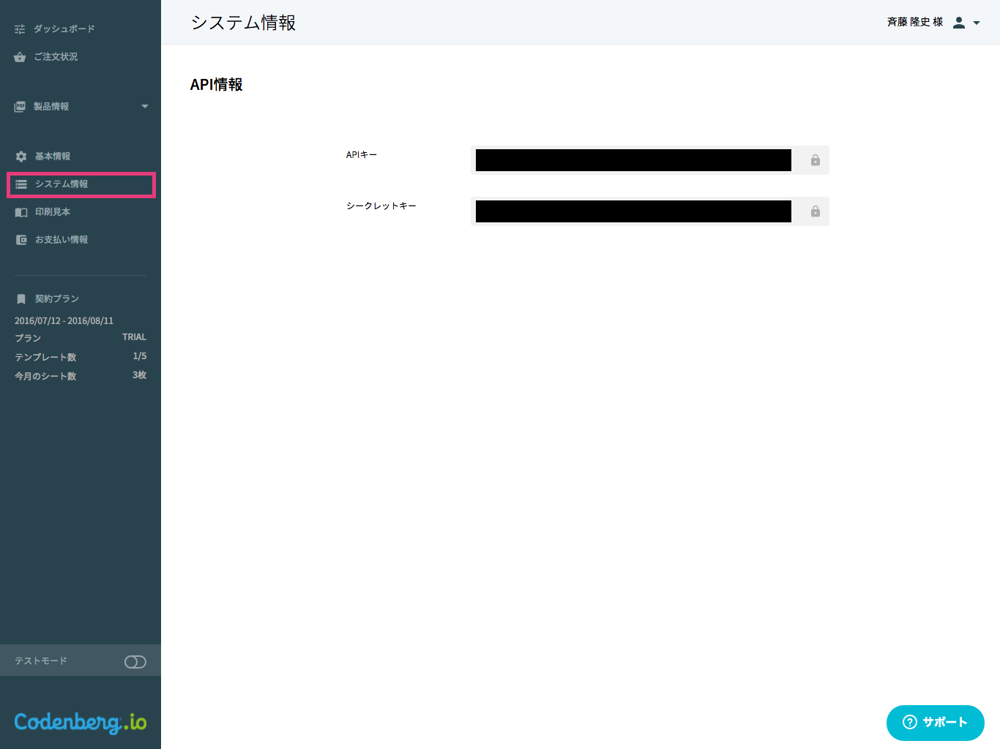

# コーデンベルク APIリファレンス ver.0.5.0

印刷APIプラットフォーム「[コーデンベルク](https://codenberg.io/)」はさまざまなシステムと連携することができるように、WebAPIを公開しています。コーデンベルク APIを使って、印刷物の注文はもちろん、テンプレートの登録や可変領域の設定ができます。コーデンベルク APIは、RESTfulな設計なのでかんたんにシステム連携できます。

## 目次

- [概要](#概要)
- [認証](#認証)
    - [必要な情報](#必要な情報)
    - [アクセストークンの取得](#アクセストークンの取得)
    - [通常アクセス](#通常アクセス)
- [テンプレート](#テンプレート)
	- [テンプレート一覧](#テンプレート一覧)
	- [テンプレート詳細](#テンプレート詳細)
	- [プレビュー](#プレビュー)
- [フォーマット](#フォーマット)
    - [フォーマット一覧](#フォーマット一覧)
    - [フォーマット詳細](#フォーマット詳細)
- [注文](#注文)
    - [注文一覧](#注文一覧)
    - [注文詳細](#注文詳細)
    - [注文作成-シングル](#注文作成-シングル)
- [メディアライブラリ](#メディアライブラリ)
    - [メディア一覧](#メディア一覧)
    - [メディア詳細](#メディア詳細)
- [都道府県一覧](#都道府県一覧)

## 概要

#### リクエスト

APIとのすべての通信にはHTTPSプロトコルを利用します。

#### エンドポイント

エンドポイントのベースURIは、`https://api.codenberg.io/v1/`です。このあとに、各エンドポイントのパスを記述してください。

##### エンドポイント一覧

- [/templates](#テンプレート)
- [/formats](#フォーマット)
- [/orders](#注文)
- [/media](#メディアライブラリ)
- [/prefectures](#都道府県一覧)

#### データ形式

APIとのデータの送受信にはJSONを利用します。

#### 文字コード

文字コードはUTF-8を利用します。

#### エスケープ文字

エスケープ文字は'\'(バックスペース)を利用します。

#### 日時のフォーマット

DatetimeのフォーマットはISO 8601を利用します。

## 認証

コーデンベルク APIを利用するには、アクセストークンをリクエストに含める必要があります。アクセストークンは、Basic認証形式で取得します。アクセストークンを利用することで、コーデンベルクの利用データを自由に閲覧、編集、操作できるため、第三者に開示しないよう取り扱いには十分ご注意ください。

### 必要な情報

認証認可を行うためには、以下の情報が必要です。

- APIキー
- シークレットキー

APIキーとシークレットキーはコーデンベルク管理画面から取得できます。




### アクセストークンの取得

Basic認証形式でアクセストークンを取得します。

```
GET /v1/auth/token
```

#### Parameters

`APIキー`と`シークレットキー`を`:(コロン)`で連結した文字列をBase64エンコードして利用します。
```
Authorization: Basic <'APIキー' + ':' + 'シークレットキー'と連結した文字列をBase64エンコードした値>
```

#### Sample code

```sh
#!/bin/sh
APIKEY='xxxxx'　#APIキー
SECRET='yyyyy'　#シークレットキー
ENCODED=`echo ${APIKEY}:${SECRET} | base64`
curl https://api.codenberg.io/v1/auth/token -H "Authorization: Basic ${ENCODED}"
```

#### Response

```json
{
    "token_type": "bearer",
    "access_token": "2f9af46b0212394aecc9a03e7190834a1ff4ffc1fb9f02e6a1c3ef3f32520664",
    "expires": "2016-07-17T16:46:08.724+09:00"
}
```

### 通常アクセス

Authorization headerにアクセストークンを含めてアクセスします。

```
curl -H "Authorization: BEARER <OAUTH-TOKEN>" https://api.codenberg.io/v1/templates
```

以下のようにquery paramsに含めてアクセスすることもできます。

```
GET https://api.codenberg.io/v1/templates?access_token=<OAUTH-TOKEN>
```

## テンプレート

APIからテンプレートの情報取得を行えます。

### テンプレート一覧

アカウントに登録されているテンプレートの一覧を返します。

```
GET /v1/templates
```

#### Parameters

Name|Type|Description
---|---|---
q|string|検索文字列を指定します。template名、キーワードが対象となります。
sort|string|id/format_id/name/keywords/created_atを指定できます。<br>Default:id.
direction|string|項目の並び順を指定します。asc(昇順)/desc(降順)<br>Default: desc
per_page|number|1ページあたりの取得項目数。最大:50件<br>Default: 10.
page|number|ページ番号を指定。<br>Default: 1.
including_private|string|非公開のテンプレートを含めるかどうかを指定します。<br>true or falseを設定します。<br>Default: false.
including_custom_fields|string|可変領域の情報を含めるかを設定します。<br>true or falseを設定します。<br>Default: true.
including_formats|string|フォーマットの情報を含めるかを設定します。<br>true or falseを設定します。<br>Default: false.


#### Response

##### 成功時

```
status: 200 OK
```

```json
{
  "count": 3,
  "page": 1,
  "per_page": 10,
  "results":[
    {
      "id": 3,
      "display_id": "TF000003",
      "name": "FF1-00024-FMT01.pdf",
      "keywords": "",
      "thumb":{"small": "http://codenberg.io/uploads/template/file/3/thumb.jpg", "large": "http://codenberg.io/uploads/template/file/3/variable_setting.jpg"…},
      "pdf": "http://codenberg.io/uploads/template/file/3/FF1-00024-FMT01.pdf",
      "page_count": 1,
      "lot_price":[
        {
          "number_from": 1,
          "number_to": 9,
          "price": 3124
        },
        {
          "number_from": 10,
          "number_to": 19,
          "price": 297
        },
        {
          "number_from": 20,
          "number_to": 29,
          "price": 122
        },
        {
          "number_from": 30,
          "number_to": 39,
          "price": 73
        },
        {
          "number_from": 40,
          "number_to": 49,
          "price": 55
        },
        {
          "number_from": 50,
          "number_to": 99,
          "price": 46
        },
        {
          "number_from": 100,
          "number_to": 199,
          "price": 34
        },
        {
          "number_from": 200,
          "number_to": 299,
          "price": 28
        },
        {
          "number_from": 300,
          "number_to": 399,
          "price": 27
        },
        {
          "number_from": 400,
          "number_to": 499,
          "price": 26
        },
        {
          "number_from": 500,
          "price": 25
        }
      ],
      "selected_paper":{
        "id": 1,
        "display_id": "PNC-0001-1",
        "name": "光沢紙 104g",
        "category": "薄紙",
        "weight_per_square_metre": 104.5,
        "paper_quality": "光沢",
        "official_quotations": 160
      },
      "finishing_option1": "none",
      "finishing_option2": null,
      "status": "public",
      "created_at": "2016-07-17T16:04:21.000+09:00",
      "updated_at": "2016-07-17T16:05:30.000+09:00",
      "custom_fields":[
      ]
    },
    {
      "id": 2,
      "display_id": "TF000002",
      "name": "FF1-00024-FMT01.pdf",
      "keywords": "",
      "thumb":{
        "small": "http://codenber.io/uploads/template/file/3/thumb.jpg",
        "large": "http://codenber.io/uploads/template/file/3/variable_setting.jpg"
      },
      "pdf": "http://codenber.io/uploads/template/file/2/FF1-00024-FMT01.pdf",
      "page_count": 1,
      "lot_price":[],
      "selected_paper":{
        "id": 1,
        "display_id": "PNC-0001-1",
        "name": "光沢紙 104g",
        "category": "薄紙",
        "weight_per_square_metre": 104.5,
        "paper_quality": "光沢",
        "official_quotations": 160
      },
      "finishing_option1": "none",
      "finishing_option2": null,
      "status": "public",
      "created_at": "2016-07-17T16:04:04.000+09:00",
      "updated_at": "2016-07-17T16:05:21.000+09:00",
      "custom_fields":[
      ]
    },
    {
      "id": 1,
      "display_id": "TF000001",
      "name": "FF1-00021-FMT01.pdf",
      "keywords": "",
      "thumb":{
        "small": "http://codenber.io/uploads/template/file/2/thumb.jpg",
        "large": "http://codenber.io/uploads/template/file/2/variable_setting.jpg"
      },
      "pdf": "http://codenber.io/uploads/template/file/1/FF1-00021-FMT01.pdf",
      "page_count": 1,
      "lot_price":[],
      "selected_paper":{
        "id": 1,
        "display_id": "PNC-0001-1",
        "name": "光沢紙 104g",
        "category": "薄紙",
        "weight_per_square_metre": 104.5,
        "paper_quality": "光沢",
        "official_quotations": 160
      },
      "finishing_option1": "none",
      "finishing_option2": null,
      "status": "private",
      "created_at": "2016-07-16T13:44:04.000+09:00",
      "updated_at": "2016-07-17T16:05:06.000+09:00",
      "custom_fields":[
        {
          "id": 4,
          "name": "MyCustomFiled",
          "field_type": "text",
          "default_value": "IPAゴシック",
          "height": 169.044,
          "rotate": 0,
          "width": 377.867,
          "x": 116.294,
          "y": 87.041,
          "max_length": null,
          "text_align": "left",
          "color_c": 0,
          "color_m": 0,
          "color_y": 0,
          "color_k": 100,
          "text_size": 39,
          "font": "IPAexGothic"
        },
        {
          "id": 5,
          "name": "MyCustomFiled",
          "field_type": "text",
          "default_value": "ラウンディド",
          "height": 105.681,
          "rotate": 0,
          "width": 544.901,
          "x": 123.976,
          "y": 342.4,
          "max_length": null,
          "text_align": "right",
          "color_c": 0,
          "color_m": 0,
          "color_y": 0,
          "color_k": 100,
          "text_size": 50,
          "font": "Rounded M+ 1p"
        },
        {
          "id": 6,
          "name": "MyCustomFiled",
          "field_type": "text",
          "default_value": "MyValue",
          "height": 249.678,
          "rotate": 0,
          "width": 633.226,
          "x": 790.214,
          "y": 92.801,
          "max_length": null,
          "text_align": "center",
          "color_c": 0,
          "color_m": 0,
          "color_y": 0,
          "color_k": 100,
          "text_size": 39,
          "font": "M+ 1p"
        },
        {
          "id": 7,
          "name": "MyCustomFiled",
          "field_type": "image",
          "default_value": "",
          "height": 234.799,
          "rotate": 0,
          "width": 639.465,
          "x": 792.136,
          "y": 380.801
        }
      ]
    }
  ]
}
```

##### 失敗時

Status Code | Description
--- | ---
400 | 入力が受け付けられない場合

### テンプレート詳細

指定したテンプレートの詳細情報を返します。

```
GET /v1/templates/:template_id
```

#### Parameters

Name|Type|Description
---|---|---
including_custom_fields|string|可変領域の情報を含めるかを設定します。<br>true or falseを設定します。<br>Default: true
including_formats|string|フォーマットの情報を含めるかを設定します。<br>true or falseを設定します。<br>Default: false

#### Response

##### 成功時

```
status: 200 OK
```

```json
{
    "id": 1,
    "display_id": "TF000001",
    "name": "FF1-00021-FMT01.pdf",
    "keywords": "",
    "thumb": {
        "small": "http://codenberg.io/uploads/template/file/1/thumb.jpg",
        "large": "http://codenberg.io/uploads/template/file/1/variable_setting.jpg"
    },
    "pdf": "http://codenberg.io/uploads/template/file/1/FF1-00021-FMT01.pdf",
    "page_count": 1,
    "lot_price": [
        {
            "number_from": 1,
            "number_to": 9,
            "price": 3124
        },
        {
            "number_from": 10,
            "number_to": 19,
            "price": 297
        },
        {
            "number_from": 20,
            "number_to": 29,
            "price": 122
        },
        {
            "number_from": 30,
            "number_to": 39,
            "price": 73
        },
        {
            "number_from": 40,
            "number_to": 49,
            "price": 55
        },
        {
            "number_from": 50,
            "number_to": 99,
            "price": 46
        },
        {
            "number_from": 100,
            "number_to": 199,
            "price": 34
        },
        {
            "number_from": 200,
            "number_to": 299,
            "price": 28
        },
        {
            "number_from": 300,
            "number_to": 399,
            "price": 27
        },
        {
            "number_from": 400,
            "number_to": 499,
            "price": 26
        },
        {
            "number_from": 500,
            "price": 25
        }
    ],
    "selected_paper": {
        "id": 4,
        "display_id": "PNM-0001-1",
        "name": "マット紙 104g",
        "category": "薄紙",
        "weight_per_square_metre": 104.5,
        "paper_quality": "マット",
        "official_quotations": 160
    },
    "finishing_option1": "none",
    "finishing_option2": "none",
    "status": "private",
    "created_at": "2016-07-16T13:44:04.000+09:00",
    "updated_at": "2016-07-17T16:05:06.000+09:00",
    "custom_fields": [
        {
            "id": 4,
            "name": "MyCustomFiled",
            "field_type": "text",
            "default_value": "IPAゴシック",
            "height": 169.044,
            "rotate": 0,
            "width": 377.867,
            "x": 116.294,
            "y": 87.041,
            "max_length": null,
            "text_align": "left",
            "color_c": 0,
            "color_m": 0,
            "color_y": 0,
            "color_k": 100,
            "text_size": 39,
            "font": "IPAexGothic"
        },
        {
            "id": 5,
            "name": "MyCustomFiled",
            "field_type": "text",
            "default_value": "MyValue",
            "height": 105.681,
            "rotate": 0,
            "width": 544.901,
            "x": 123.976,
            "y": 342.4,
            "max_length": null,
            "text_align": "right",
            "color_c": 0,
            "color_m": 0,
            "color_y": 0,
            "color_k": 100,
            "text_size": 50,
            "font": "Rounded M+ 1p"
        },
        {
            "id": 6,
            "name": "MyCustomFiled",
            "field_type": "text",
            "default_value": "MyValue",
            "height": 249.678,
            "rotate": 0,
            "width": 633.226,
            "x": 790.214,
            "y": 92.801,
            "max_length": null,
            "text_align": "center",
            "color_c": 0,
            "color_m": 0,
            "color_y": 0,
            "color_k": 100,
            "text_size": 39,
            "font": "M+ 1p"
        },
        {
            "id": 7,
            "name": "MyCustomFiled",
            "field_type": "image",
            "default_value": "",
            "height": 234.799,
            "rotate": 0,
            "width": 639.465,
            "x": 792.136,
            "y": 380.801
        }
    ]
}
```

##### 失敗時

Status Code | Description
--- | ---
400 | 入力が受け付けられない場合

### プレビュー

指定したテンプレートのプレビューを返します。

```
POST /v1/templates/:template_id/preview
```

#### Parameters

カスタムフィールドの値をJSON形式の配列として送信します。

Content-Type: application/json

```json
{
	"custom_fields":[
		{
			"id": "4",
			"value": "テキストプレビュー1"
		},
		{
			"id": "5",
			"value": "テキストプレビュー2"
		},
		{
			"id": "6",
			"value": "テキストプレビュー3"
		},
		{
			"id": "5",
			"value": "1"
		}
	]
}
```

#### Response

作成された画像の配列が表示されます。

##### 成功時

```
status: 200 OK
```

```json
{
    "images": [
        "https://codenberg.io/uploads/tmp/pt/120160717-7-hbr6gn_0.jpg"
    ]
}

```

##### 失敗時

Status Code | Description
--- | ---
400 | 入力が受け付けられない場合

## フォーマット

コーデンベルクが用意しているフォーマットの情報を返します。用紙サイズや印刷費、用紙の種類などを取得できます。

### フォーマット一覧

利用可能なフォーマットの一覧を返します。

```
GET /formats
```


#### Parameters

Name|Type|Description
---|---|---
q|string|検索文字列。format名、用途から検索できます。
sort|string| id/name<br>Default:id
direction|string|項目の並び順を指定します。asc(昇順)/desc(降順)<br>Default: desc
per_page|number|1ページあたりの取得項目数。最大:50件<br>Default: 10
page|number|ページ番号を指定します。<br>Default: 1

#### Response

##### 成功時

```
status: 200 OK
```

```json
{
    "count": 24,
    "page": 1,
    "per_page": 10,
    "results": [
        {
            "id": 48,
            "display_id": "FF1-00024",
            "name": "B2-ヨコ（マット）－片面",
            "category": "平面",
            "developed_width": 706,
            "developed_height": 500,
            "width": 706,
            "height": 500,
            "depth": 0,
            "weight": 36.7,
            "lot_price": [
                {
                    "number_from": 1,
                    "number_to": 9,
                    "price": 3124
                },
                {
                    "number_from": 10,
                    "number_to": 19,
                    "price": 297
                },
                {
                    "number_from": 20,
                    "number_to": 29,
                    "price": 122
                },
	            〜 省略 〜
            ],
            "coart": "表のみ",
            "varnish": "表のみ",
            "purpose": [
                "ポスター"
            ],
            "pattern_no": null,
            "per_sheet": 1,
            "note": null,
            "file": "http://codenberg.io/uploads/format/file/48/FF1-00024-FMT01.ai",
            "main_image": "http://codenberg.io/uploads/format/main_image/48/aa453fca-4244-443b-a082-5fbecf530996.png",
            "selectable_papers": [
                {
                    "id": 1,
                    "display_id": "PNC-0001-1",
                    "name": "光沢紙 104g",
                    "category": "薄紙",
                    "weight_per_square_metre": 104.5,
                    "paper_quality": "光沢",
                    "official_quotations": 160
                },
                {
                    "id": 2,
                    "display_id": "PNC-0001-2",
                    "name": "光沢紙 128g",
                    "category": "薄紙",
                    "weight_per_square_metre": 128,
                    "paper_quality": "光沢",
                    "official_quotations": 160
                },
                {
                    "id": 3,
                    "display_id": "PNC-0001-3",
                    "name": "光沢紙 157g",
                    "category": "薄紙",
                    "weight_per_square_metre": 157,
                    "paper_quality": "光沢",
                    "official_quotations": 160
                },
                {
                    "id": 16,
                    "display_id": "PNP-0001",
                    "name": "写真用紙 185g",
                    "category": "薄紙",
                    "weight_per_square_metre": 185,
                    "paper_quality": "光沢（表のみ）",
                    "official_quotations": 0
                }
            ]
        },
        {
            "id": 47,
            "display_id": "FF1-00023",
            "name": "B3ヨコ（マット）－片面",
            "category": "平面",

            〜 省略 〜

        },
        {
            "id": 46,
            "display_id": "FF1-00022",
            "name": "B4ヨコ（マット）－片面",
            "category": "平面",

            〜 省略 〜

        },
        {
            "id": 45,
            "display_id": "FF1-00021",
            "name": "A2ヨコ（マット）－片面",
            "category": "平面",

            〜 省略 〜

        },
        {
            "id": 44,
            "display_id": "FF1-00020",
            "name": "A3ヨコ（マット）－片面",
            "category": "平面",

            〜 省略 〜

        },
        {
            "id": 43,
            "display_id": "FF1-00019",
            "name": "A4ヨコ（マット）－片面",
            "category": "平面",

            〜 省略 〜

        },
        {
            "id": 42,
            "display_id": "FF1-00018",
            "name": "B2-ヨコ（光沢）－片面",
            "category": "平面",

            〜 省略 〜

        },
        {
            "id": 41,
            "display_id": "FF1-00017",
            "name": "B3ヨコ（光沢）－片面",
            "category": "平面",

            〜 省略 〜

        },
        {
            "id": 40,
            "display_id": "FF1-00016",
            "name": "B4ヨコ（光沢）－片面",
            "category": "平面",

            〜 省略 〜

        },
        {
            "id": 39,
            "display_id": "FF1-00015",
            "name": "A2ヨコ（光沢）－片面",
            "category": "平面",

            〜 省略 〜

        }
    ]
}
```

##### 失敗時

Status Code | Description
--- | ---
400 | 入力が受け付けられない場合

### フォーマット詳細

指定したフォーマットの詳細情報を返します。

```
GET /v1/formats/:format_id
```

#### Parameters

ありません。

#### Response

##### 成功時

```
status: 200 OK
```

```json
{
    "id": 48,
    "display_id": "FF1-00024",
    "name": "B2-ヨコ（マット）－片面",
    "category": "平面",
    "developed_width": 706,
    "developed_height": 500,
    "width": 706,
    "height": 500,
    "depth": 0,
    "weight": 36.7,
    "lot_price": [
        {
            "number_from": 1,
            "number_to": 9,
            "price": 3124
        },
        {
            "number_from": 10,
            "number_to": 19,
            "price": 297
        },
        {
            "number_from": 20,
            "number_to": 29,
            "price": 122
        },
        {
            "number_from": 30,
            "number_to": 39,
            "price": 73
        },
        {
            "number_from": 40,
            "number_to": 49,
            "price": 55
        },
        {
            "number_from": 50,
            "number_to": 99,
            "price": 46
        },
        {
            "number_from": 100,
            "number_to": 199,
            "price": 34
        },
        {
            "number_from": 200,
            "number_to": 299,
            "price": 28
        },
        {
            "number_from": 300,
            "number_to": 399,
            "price": 27
        },
        {
            "number_from": 400,
            "number_to": 499,
            "price": 26
        },
        {
            "number_from": 500,
            "price": 25
        }
    ],
    "coart": "表のみ",
    "varnish": "表のみ",
    "purpose": [
        "ポスター"
    ],
    "pattern_no": null,
    "per_sheet": 1,
    "note": null,
    "file": "http://codenberg.io/uploads/format/file/48/FF1-00024-FMT01.ai",
    "main_image": "http://codenberg.io/uploads/format/main_image/48/aa453fca-4244-443b-a082-5fbecf530996.png",
    "selectable_papers": [
        {
            "id": 1,
            "display_id": "PNC-0001-1",
            "name": "光沢紙 104g",
            "category": "薄紙",
            "weight_per_square_metre": 104.5,
            "paper_quality": "光沢",
            "official_quotations": 160
        },
        {
            "id": 2,
            "display_id": "PNC-0001-2",
            "name": "光沢紙 128g",
            "category": "薄紙",
            "weight_per_square_metre": 128,
            "paper_quality": "光沢",
            "official_quotations": 160
        },
        {
            "id": 3,
            "display_id": "PNC-0001-3",
            "name": "光沢紙 157g",
            "category": "薄紙",
            "weight_per_square_metre": 157,
            "paper_quality": "光沢",
            "official_quotations": 160
        },
        {
            "id": 16,
            "display_id": "PNP-0001",
            "name": "写真用紙 185g",
            "category": "薄紙",
            "weight_per_square_metre": 185,
            "paper_quality": "光沢（表のみ）",
            "official_quotations": 0
        }
    ]
}
```

##### 失敗時

Status Code | Description
--- | ---
400 | 入力が受け付けられない場合


## 注文

APIから新たな注文を作成したり、これまでの注文一覧を取得したりできます。

### 注文一覧

注文一覧を返します。

```
GET /v1/orders
```

#### Parameters

Name|Type|Description
---|---|---
sort|string| 並び順の基準とする項目を指定します。<br>id/created_at/status/order_numberが指定可能。<br>Default:id
direction|string|項目の並び順を指定します。asc(昇順)/desc(降順)<br>Default: desc
per_page|number|1ページあたりの取得項目数。最大:50件<br>Default: 10
page|number|ページ番号を指定します。<br>Default: 1
range_key|string|絞り込みを行う日付を指定します。create_at、updated_atが選択可<br>Default: created_at<br>(optional)
from|string|指定すると指定した日付以降の項目を抽出します。<br>(optional)
to|string|指定すると指定した日付以前の項目を抽出します。<br>(optional)
including_test|string|true or false. テストモードで登録した注文を含めるかどうかを指定します。<br>Default: false

#### Response

##### 成功時

```
status: 200 OK
```

```json
{
    "count": 11,
    "page": 1,
    "per_page": 10,
    "results": [
        {
            "id": 14,
            "display_id": "BETA-000014",
            "printing_fee": 3124,
            "system_usage_charge": 0,
            "sub_total": 3124,
            "consumption_tax": 250,
            "delivery_fee": 1110,
            "total": 4484,
            "sheets": 1,
            "total_number": 1,
            "orders": [
                {
                    "id": 14,
                    "display_id": "00000014",
                    "name": "金曜 武士",
                    "pref": {
                        "id": 13,
                        "name": "東京都"
                    },
                    "postal_code": "1080074",
                    "city": "港区高輪",
                    "address_line1": "3-25-29",
                    "address_line2": "The Site #07",
                    "organization": null,
                    "tel": "0364557650",
                    "order_number": 1,
                    "template_id": 1,
                    "custom_fields": [
                        {
                            "id": 4,
                            "value": "テキストカスタムフィールド設定値1"
                        },
                        {
                            "id": 5,
                            "value": "テキストカスタムフィールド設定値2"
                        },
                        {
                            "id": 6,
                            "value": "テキストカスタムフィールド設定値3"
                        },
                        {
                            "id": 7,
                            "value": "2"
                        }
                    ],
                    "status": "checking",
                    "created_at": "2016-07-16T23:30:32.000+09:00"
                }
            ]
        },
        {
            "id": 10,
            "display_id": "BETA-000010",
            "printing_fee": 3124,
            "system_usage_charge": 0,
            "sub_total": 3124,
            "consumption_tax": 250,
            "delivery_fee": 1110,

            〜 省略 〜

            ]
        },
        {
            "id": 9,
            "display_id": "BETA-000009",
            "printing_fee": 3124,
            "system_usage_charge": 0,
            "sub_total": 3124,
            "consumption_tax": 250,
            "delivery_fee": 1110,

            〜 省略 〜

        },
        {
            "id": 8,
            "display_id": "BETA-000008",
            "printing_fee": 3124,
            "system_usage_charge": 0,
            "sub_total": 3124,
            "consumption_tax": 250,
            "delivery_fee": 1110,

            〜 省略 〜

		},
        {
            "id": 7,
            "display_id": "BETA-000007",
            "printing_fee": 3124,
            "system_usage_charge": 1,
            "sub_total": 3125,
            "consumption_tax": 250,
            "delivery_fee": 1110,

            〜 省略 〜

        },
        {
            "id": 6,
            "display_id": "BETA-000006",
            "printing_fee": 3124,
            "system_usage_charge": 1,
            "sub_total": 3125,
            "consumption_tax": 250,
            "delivery_fee": 1110,

            〜 省略 〜

        },
        {
            "id": 5,
            "display_id": "BETA-000005",
            "printing_fee": 3124,
            "system_usage_charge": 1,
            "sub_total": 3125,
            "consumption_tax": 250,
            "delivery_fee": 1110,

            〜 省略 〜

        },
        {
            "id": 4,
            "display_id": "BETA-000004",
            "printing_fee": 3124,
            "system_usage_charge": 1,
            "sub_total": 3125,
            "consumption_tax": 250,
            "delivery_fee": 1110,

            〜 省略 〜

        },
        {
            "id": 3,
            "display_id": "BETA-000003",
            "printing_fee": 3124,
            "system_usage_charge": 1,
            "sub_total": 3125,
            "consumption_tax": 250,
            "delivery_fee": 1110,

            〜 省略 〜

        },
        {
            "id": 2,
            "display_id": "BETA-000002",
            "printing_fee": 3124,
            "system_usage_charge": 1,
            "sub_total": 3125,
            "consumption_tax": 250,
            "delivery_fee": 1110,

            〜 省略 〜

        }
    ]
}
```

##### 失敗時

Status Code | Description
--- | ---
400 | 入力が受け付けられない場合

### 注文詳細

注文の詳細情報を返します。

#### Parameters
```
GET /v1/orders/:id
```

#### Response

##### 成功時

```
status: 200 OK
```

```json
{
    "id": 1,
    "display_id": "BETA-000001",
    "printing_fee": 3124,
    "system_usage_charge": 1,
    "sub_total": 3125,
    "consumption_tax": 250,
    "delivery_fee": 1110,
    "total": 4485,
    "sheets": 1,
    "total_number": 1,
    "orders": [
        {
            "id": 1,
            "display_id": "00000001",
            "name": "金曜武士",
            "pref": {
                "id": 13,
                "name": "東京都"
            },
            "postal_code": "1080074",
            "city": "港区高輪",
            "address_line1": "3-25-29",
            "address_line2": "The Site #07",
            "organization": null,
            "tel": "0364557650",
            "order_number": 1,
            "template_id": 1,
            "custom_fields": [
                {
                    "id": 4,
                    "value": "テキストカスタムフィールド設定値1"
                },
                {
                    "id": 5,
                    "value": "テキストカスタムフィールド設定値2"
                },
                {
                    "id": 6,
                    "value": "1"
                }
            ],
            "status": "checking",
            "created_at": "2016-07-16T17:23:40.000+09:00"
        }
    ]
}
```

##### 失敗時

Status Code | Description
--- | ---
400 | 入力が受け付けられない場合

### 注文作成-シングル

テンプレートから注文を作成します。

```
POST /v1/orders
```

#### Parameters

JSON形式で送信してください。


|Name|Type|Require|Description|
|---|---|---|---|
|template_id|number|◯| テンプレートidを指定します。|
|confirmation|string|◯| true or false。trueを設定すると実際の登録はおこなわれません。|
|postal_code|string|◯|郵便番号。|
|pref|string|◯|都道府県名。|
|city|string|◯|市区町村。|
|address_line1|string|◯|番地。|
|address_line2|string||建物名。<br>(optional)|
|organization|string||組織名。<br>(optional)|
|name|string|◯|宛名|
|tel|string|◯|連絡先電話番号|
|custom_fields|array|可変領域が設定されている時、必須|可変領域を指定します。|
|custom_fields.id|number||カスタムフィールドID|
|custom_fields.value|string||設定値。テキスト or 画像ID|

<例>
Content-type: application/json

```json
	{
		"template_id": "1",
		"confirmation":"false",
		"name":"金曜 武士",
		"postal_code": "1080074",
		"pref": 13,
		"city": "港区",
		"address_line1": "高輪3-25-29",
		"address_line2": "The Site #07",
		"organization": "株式会社フライデーナイト",
		"tel": "0364557650",
		"custom_fields": [
			{
			"id": 4,
			"value":"テキストカスタムフィールド1"
			},
			{
			"id": 5,
			"value":"テキストカスタムフィールド2"
			},
			{
			"id": 6,
			"value":"テキストカスタムフィールド3"
			},
			{
			"id": 7,
			"value": 2
			}
		]
	}
```

#### Response

登録した注文情報を返します。

##### 成功時

```
status: 200 OK
```

```json
{
    "id": 15,
    "display_id": "BETA-000015",
    "printing_fee": 3124,
    "system_usage_charge": 0,
    "sub_total": 3124,
    "consumption_tax": 250,
    "delivery_fee": 1110,
    "total": 4484,
    "sheets": 1,
    "total_number": 1,
    "orders": [
        {
            "id": 15,
            "display_id": "00000015",
            "name": "金曜武士",
            "pref": {
                "id": 13,
                "name": "東京都"
            },
            "postal_code": "1080074",
            "city": "港区",
            "address_line1": "高輪3-25-29",
            "address_line2": "The Site #07",
            "organization": "株式会社フライデーナイト",
            "tel": "0364557650",
            "order_number": 1,
            "template_id": 1,
            "custom_fields": [
                {
                    "id": 4,
                    "value": "テキストカスタムフィールド1"
                },
                {
                    "id": 5,
                    "value": "テキストカスタムフィールド2"
                },
                {
                    "id": 6,
                    "value": "テキストカスタムフィールド3"
                },
                {
                    "id": 7,
                    "value": "2"
                }
            ],
            "status": "checking",
            "created_at": "2016-07-17T22:54:48.000+09:00"
        }
    ]
}
```

##### 失敗時

Status Code | Description
--- | ---
400 | 入力が受け付けられない場合
404 Not Found | Resource not found.
422 Unprocessable Entity | 注文情報の形式が正しくありません


## メディアライブラリ

可変領域に設定する画像の情報を取得できます。

### メディア一覧

登録されているメディアの一覧を返します。

#### Parameters

| Name  | Type | Description |
| ------------- | ------------- | ------------- |
| q | string | 指定して文字でファイル名を対象に検索します。 |
| sort | string | 並び順の基準とする項目を指定します。id/name/created_atが指定可能。<br>Default:id. |
| direction | string | 項目の並び順を指定します。asc(昇順)/desc(降順)<br>Default: desc |
| per_page | number | 1ページあたりの取得項目数。最大:50件<br>Default: 10. |
| page | number  | ページ番号を指定します。<br>Default: 1. |

#### Response

##### 成功時

```
status: 200 OK
```

```json
{
    "count": 6,
    "page": 1,
    "per_page": 10,
    "results": [
        {
            "id": 8,
            "name": "Image01.tif",
            "file": "http://codenberg.io/uploads/medium/file/8/8b375718-b578-435b-abcc-124dc1a57f94.tif",
            "thumb": {
                "default": "http://codenberg.io/uploads/medium/file/8/thumb_8b375718-b578-435b-abcc-124dc1a57f94.tif",
                "square": "http://codenberg.io/uploads/medium/file/8/thumb_square_8b375718-b578-435b-abcc-124dc1a57f94.tif"
            },
            "created_at": "2016-07-16T19:43:27.000+09:00"
        },
        {
            "id": 7,
            "name": "test08.tif",
            "file": "http://codenberg.io/uploads/medium/file/7/f1bad6bb-43c0-45ed-8360-b939358ba3f9.tif",
            "thumb": {
                "default": "http://codenberg.io/uploads/medium/file/7/thumb_f1bad6bb-43c0-45ed-8360-b939358ba3f9.tif",
                "square": "http://codenberg.io/uploads/medium/file/7/thumb_square_f1bad6bb-43c0-45ed-8360-b939358ba3f9.tif"
            },
            "created_at": "2016-07-16T19:26:19.000+09:00"
        },

        〜 省略 〜

        {
            "id": 6,
            "name": "f4afc7ad-9fa4-4f62-a302-801f64080f9f.tif",
            "file": "http://codenberg.io/uploads/medium/file/6/b5b68dc2-409f-4c6e-8c0d-7fd71e3569c3.tif",
            "thumb": {
                "default": "http://codenberg.io/uploads/medium/file/6/thumb_b5b68dc2-409f-4c6e-8c0d-7fd71e3569c3.tif",
                "square": "http://codenberg.io/uploads/medium/file/6/thumb_square_b5b68dc2-409f-4c6e-8c0d-7fd71e3569c3.tif"
            },
            "created_at": "2016-07-16T18:48:20.000+09:00"
        }
    ]
}
```

##### 失敗時

Status Code | Description
--- | ---
400 | 入力が受け付けられない場合

### メディア詳細

登録されているメディアの詳細を返します。

```
GET /v1/media/:media_id
```

#### Parameters

ありません。

#### Response

##### 成功時

```
status: 200 OK
```

```json
{
    "id": 2,
    "name": "100829_1508-01.jpg",
    "file": "http://codenberg.io/uploads/medium/file/2/9989faa8-653e-4917-a680-b0b92868ef82.jpg",
    "thumb": {
        "default": "http://codenberg.io/uploads/medium/file/2/thumb_9989faa8-653e-4917-a680-b0b92868ef82.jpg",
        "square": "http://codenberg.io/uploads/medium/file/2/thumb_square_9989faa8-653e-4917-a680-b0b92868ef82.jpg"
    },
    "created_at": "2016-07-16T17:48:22.000+09:00"
}

```

##### 失敗時

Status Code | Description
--- | ---
400 | 入力が受け付けられない場合


## 都道府県一覧

APIからコーデンベルクで扱う都道府県の一覧情報取得を行えます。

### 都道府県一覧

コーデンベルクで扱うことができる都道府県の県名とコードの一覧を返します。

```
GET /v1/prefectures
```

#### Parameters

なし

#### Response

##### 成功時

```
status: 200 OK
```

```json
[
  {
    "id": 1,
    "name": "北海道"
  },
  {
    "id": 2,
    "name": "青森県"
  },
  {
    "id": 3,
    "name": "岩手県"
  },
  {
    "id": 4,
    "name": "宮城県"
  },
  {
    "id": 5,
    "name": "秋田県"
  },
  {
    "id": 6,
    "name": "山形県"
  },
  {
    "id": 7,
    "name": "福島県"
  },
  {
    "id": 8,
    "name": "茨城県"
  },
  {
    "id": 9,
    "name": "栃木県"
  },
  {
    "id": 10,
    "name": "群馬県"
  },
  {
    "id": 11,
    "name": "埼玉県"
  },
  {
    "id": 12,
    "name": "千葉県"
  },
  {
    "id": 13,
    "name": "東京都"
  },
  {
    "id": 14,
    "name": "神奈川県"
  },
  {
    "id": 15,
    "name": "新潟県"
  },
  {
    "id": 16,
    "name": "富山県"
  },
  {
    "id": 17,
    "name": "石川県"
  },
  {
    "id": 18,
    "name": "福井県"
  },
  {
    "id": 19,
    "name": "山梨県"
  },
  {
    "id": 20,
    "name": "長野県"
  },
  {
    "id": 21,
    "name": "岐阜県"
  },
  {
    "id": 22,
    "name": "静岡県"
  },
  {
    "id": 23,
    "name": "愛知県"
  },
  {
    "id": 24,
    "name": "三重県"
  },
  {
    "id": 25,
    "name": "滋賀県"
  },
  {
    "id": 26,
    "name": "京都府"
  },
  {
    "id": 27,
    "name": "大阪府"
  },
  {
    "id": 28,
    "name": "兵庫県"
  },
  {
    "id": 29,
    "name": "奈良県"
  },
  {
    "id": 30,
    "name": "和歌山県"
  },
  {
    "id": 31,
    "name": "鳥取県"
  },
  {
    "id": 32,
    "name": "島根県"
  },
  {
    "id": 33,
    "name": "岡山県"
  },
  {
    "id": 34,
    "name": "広島県"
  },
  {
    "id": 35,
    "name": "山口県"
  },
  {
    "id": 36,
    "name": "徳島県"
  },
  {
    "id": 37,
    "name": "香川県"
  },
  {
    "id": 38,
    "name": "愛媛県"
  },
  {
    "id": 39,
    "name": "高知県"
  },
  {
    "id": 40,
    "name": "福岡県"
  },
  {
    "id": 41,
    "name": "佐賀県"
  },
  {
    "id": 42,
    "name": "長崎県"
  },
  {
    "id": 43,
    "name": "熊本県"
  },
  {
    "id": 44,
    "name": "大分県"
  },
  {
    "id": 45,
    "name": "宮崎県"
  },
  {
    "id": 46,
    "name": "鹿児島県"
  },
  {
    "id": 47,
    "name": "沖縄県"
  }
]

```

